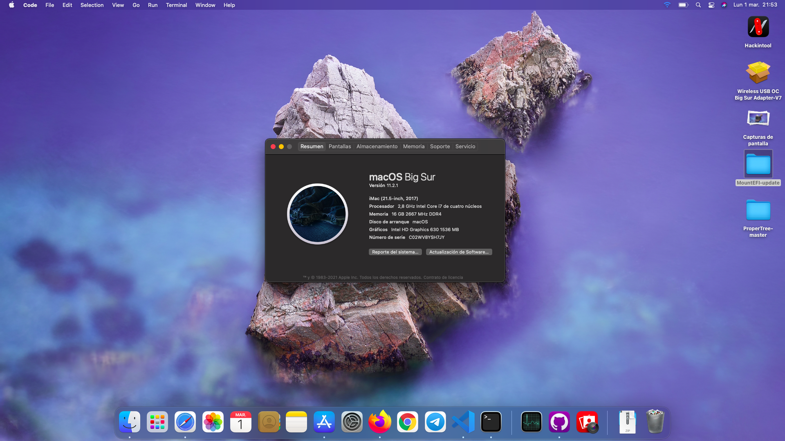

# geminis3's OpenCore EFI for Predator Helios 300 2017 (G3-571)
This config was adapted for my specific hardware and usage requirements, feel free to use this as a reference / starting point for your Hackintosh journey.

## My custom specs (not stock)
- 1TB WD SN550 NVMe with Windows as main drive
- 120GB Kingston A400 SSD for macOS
- GC-EXTREME thermal paste

## Screenshot

## What's working ✅
- Display
- Hardware acceleration (iGPU video encode/decode)
- Keyboard (backlight too)
- Trackpad with gestures
- ALC 255 Audio (mic quality is bad everything else somewhat on par with Linux but inferior than Windows)
- Realtek Ethernet (set as built-in)
- Webcam
- USB ports
- Bluetooth
- My Archer T2U Nano USB WiFi
- Disabled dGPU through ACPI

## What's not working (aka no drivers) ✋ 🚫
- QCA61x4A WiFi
- Nvidia GTX 1060 dGPU
- HDMI output (depends on dGPU)
- SD Card reader

## BIOS Settings 💻
- Boot mode `UEFI`
- Virtualization thingy `enable`
- Secure boot `disable`
- Touchpad `Advanced`

## TODO
- Make touchpad work without `Change _OSI to XOSI` patch
- Improve power management / battery life